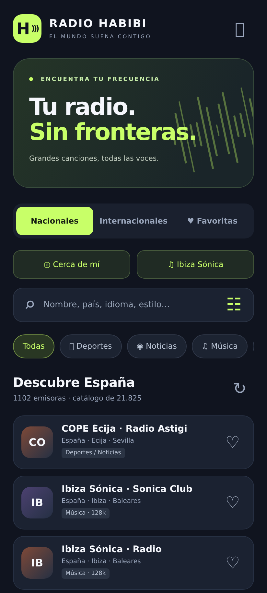
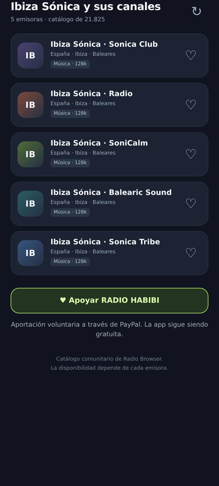
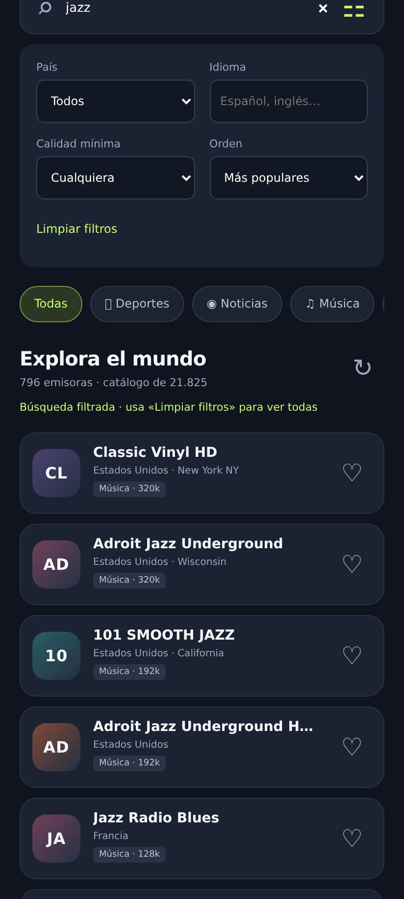

# 📻 RADIO HABIBI

### Tu radio. Sin fronteras.

**Las voces de tu ciudad y los sonidos del mundo, en una sola app para Android.** Descubre música, sigue la actualidad y vive el deporte con miles de emisoras de España y del resto del mundo. Guarda tus favoritas y encuentra tu próxima compañía sonora con una interfaz oscura, clara y fácil de recorrer.

**[⬇️ Descargar la última APK](https://github.com/fhebler-commits/radio-habibi/releases/latest)** · **[💛 Apoyar con una donación](https://www.paypal.com/donate/?hosted_button_id=P9WD5GXWT452U)** · [Comunicar un problema](https://github.com/fhebler-commits/radio-habibi/issues)

Gratis · Android 8.0 o posterior · Sin cuenta · Sin publicidad añadida por la app

## Así se ve

  
  
  

*Capturas de la interfaz de la app renderizada en navegador con formato móvil. Las funciones nativas, como las notificaciones y Android Auto, no se muestran en estas imágenes.*

## Encuentra lo que te apetece escuchar

- **España y el mundo, bien organizados.** Emisoras nacionales e internacionales, con categorías de deportes, noticias, música y varios.
- **Un buscador que va más allá del nombre.** Busca por país, región, idioma o estilo; filtra por país, idioma y calidad mínima, y ordena por popularidad, nombre o calidad.
- **Tus favoritas, siempre a mano.** Guarda las emisoras que más escuchas.
- **Descubre radios cercanas.** Activa «Cerca de mí» y concede permiso de ubicación para encontrar emisoras por proximidad.
- **Ibiza Sónica en un toque.** Accede a Radio, SoniCa Club, SoniCalm, Tribe y Balearic Sound. También encontrarás COPE Écija / Radio Astigi.
- **Pausa y continúa.** Recupera lo que estabas escuchando mientras siga disponible en el búfer de la sesión.
- **Controles en las notificaciones y soporte para Android Auto.** Lleva tu radio contigo y controla la reproducción con comodidad.
- **La identidad de cada emisora.** Logotipos y carátulas cuando están disponibles; iniciales cuando no los hay.

## Instala RADIO HABIBI

1. Abre [la última versión publicada](https://github.com/fhebler-commits/radio-habibi/releases/latest).
2. Descarga el archivo **RADIO-HABIBI-1.4.apk** de la sección **Assets**.
3. Ábrelo en tu móvil Android e instala la aplicación. Si Android lo solicita, autoriza la instalación desde la aplicación con la que has abierto la APK.

Para actualizar, instala la nueva APK sobre la versión anterior. Este repositorio reúne las descargas y la documentación de RADIO HABIBI.

### Android Auto

La app incluye integración multimedia para Android Auto. Al instalarla mediante APK, puede ser necesario habilitar **Fuentes desconocidas** en los ajustes de desarrollador de Android Auto para que aparezca en su lista de aplicaciones. Esta opción pertenece a Android Auto y es distinta del permiso de instalación de APK de Android.

### Sobre la pausa y las emisiones

La pausa depende de un búfer temporal y de las características de cada emisión. No es una grabación permanente: el contenido puede perderse al cambiar de emisora, detener la sesión o cerrar el proceso. La app necesita internet y puede seguir consumiendo datos durante la pausa para conservar audio. La disponibilidad y la publicidad propia de cada emisora dependen de su proveedor.

### Ubicación y privacidad

La búsqueda cercana pide permiso al utilizarla. La ubicación se usa para calcular distancias a las emisoras; sus coordenadas pueden corresponder a la sede y no representan cobertura de radio FM. Las favoritas se guardan en el dispositivo y no necesitas crear una cuenta.

## Ayuda a que suene más lejos

Si RADIO HABIBI te acompaña, puedes darle una **⭐ al repositorio**, compartir su enlace o [comunicar errores y sugerencias](https://github.com/fhebler-commits/radio-habibi/issues).

Las donaciones son voluntarias y ayudan a apoyar el proyecto:

### [💛 Donar con PayPal](https://www.paypal.com/donate/?hosted_button_id=P9WD5GXWT452U)

Gracias por escuchar y compartir RADIO HABIBI.

---

**English:** RADIO HABIBI is a free Android internet radio player for stations from Spain and around the world, with favorites, advanced search, nearby stations, temporary pause buffering and Android Auto support. Download the APK from [Releases](https://github.com/fhebler-commits/radio-habibi/releases/latest).
